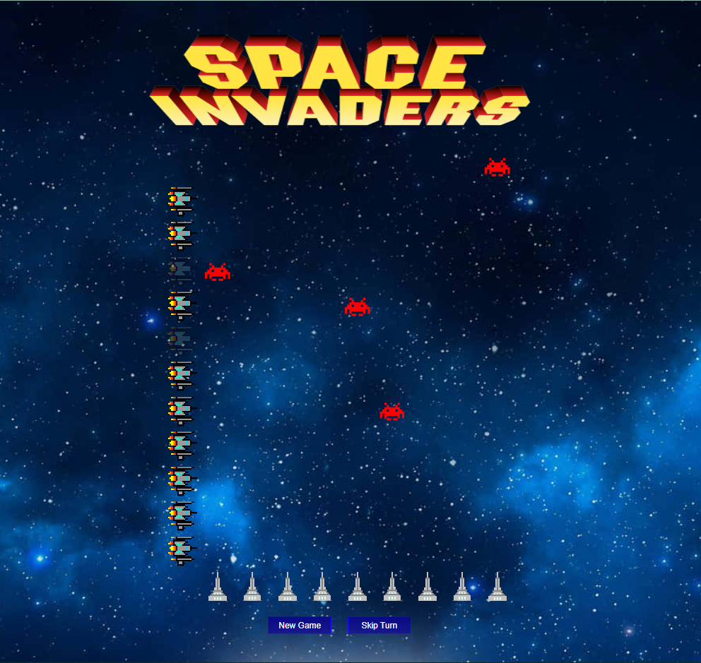

# Space Invaders

This game was designed for an assignment job. Original idea was simpler and didn't include a graphic design. I have upgraded the concept, code and made a little design and added sound effects
## What is this game about?
Goal is simple - do not let aliens destroy your town. Each cannon can destroy one row of alien ships. New aliens are randomly generated each turn. Game ends if an alien will breach through our buildings
or we will destroy all aliens on the map
## Implementation notes
This game was scripted using TypeScript not JavaScript, ts file was compiled into js file which is then used by the page
