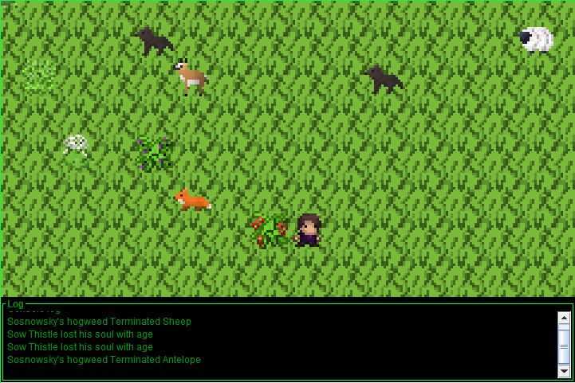

# World Simulator
  
This is simple project written as an assignment job in Java. It "Simulates" World. This is simple version, not developed much.  
It uses Swing library to create Console log and game window. Game window is hand-written JComponent with custom rendering. It includes simple Action system, interface to render world and interface
to implement new entities

## Game Features
+ Multiple Plants and Animals with unique skills
+ Plants and Animals die after getting old
+ Breeding of Plants and Animals
+ Very simple combat system
+ Save / Load Game using F5/F9
+ Special ability of human - Incinerate - R
+ Custom implementation of Camera

FPS are limited to 2, to make feeling of turn based game. All actions are performed after player movement

## Further development
Further development is not planned. I would rather want to create custom project in Unity to learn it, rather than developing this. Still cool experience in writing my own usable rendering and
interface to add new content.
